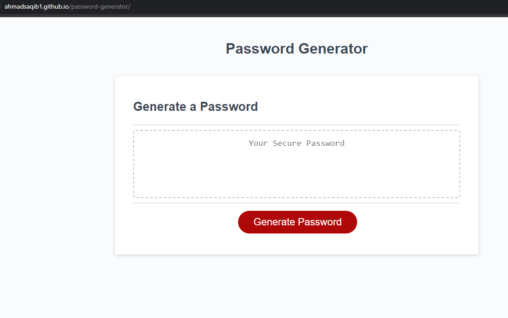
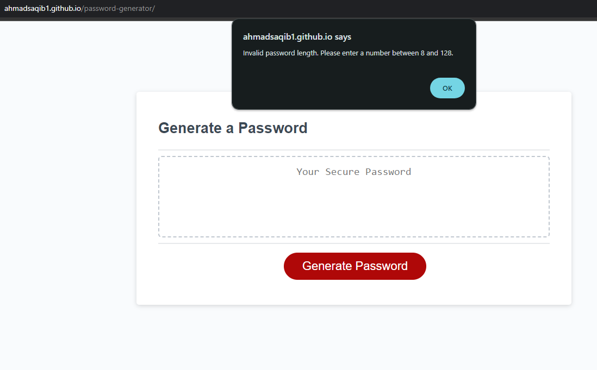
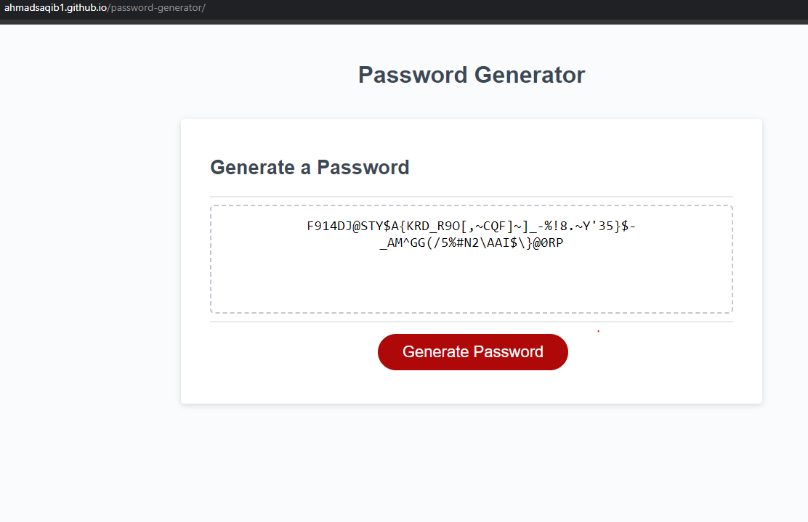

# Password Generator

## Overview
This app generates a password based upon user's preferences
  * Present a series of prompts for password criteria
    * Length of password
      * At least 8 characters but no more than 128.
    * Character types
      * Lowercase
      * Uppercase
      * Numeric
      * Special characters ($@%&*, etc)
  * Code should validate for each input and at least one character type should be selected
  * Once prompts are answered then the password should be generated and displayed in an alert or written to the page

## Website visuals 
The following image shows the web application's appearance and functionality:

## Technologies
* HTML
* CSS
* Javascript

## Website
https://ahmadsaqib1.github.io/password-generator/

## Contributions
Made by Ahmad Saqib